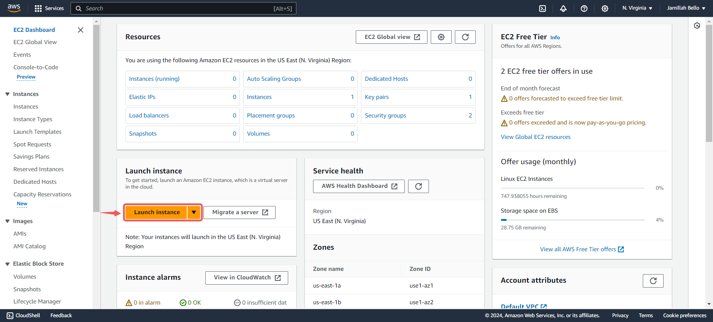
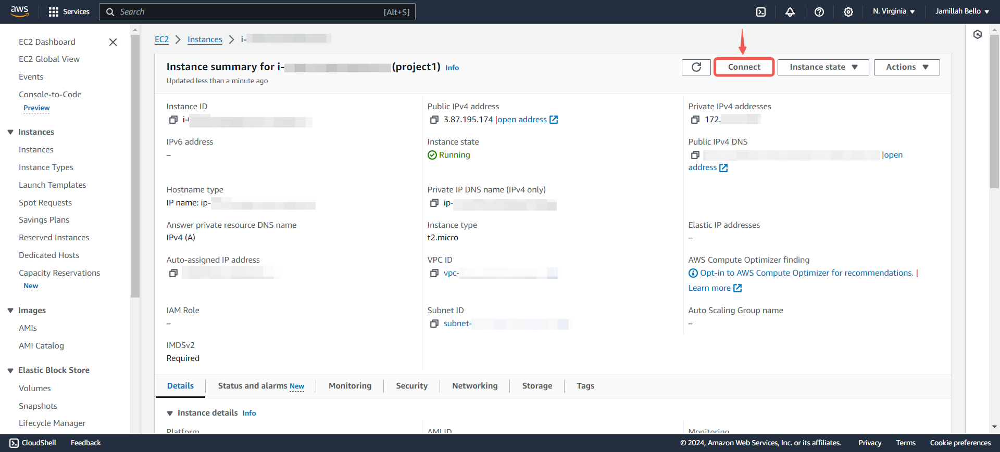
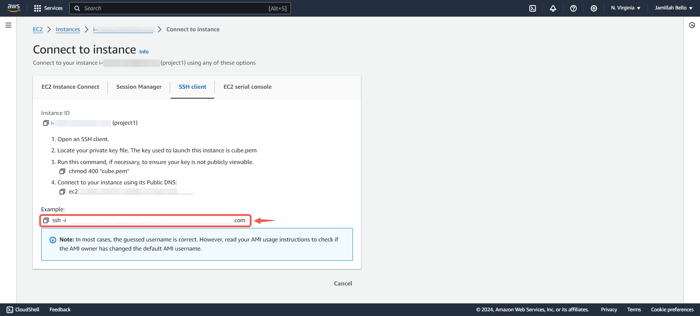

# Practical DevOps Assessment - Create an Ubuntu Server

|S/N | Project Tasks                                             |
|----|-----------------------------------------------------------|
| 1  |Create an EC2 instance using the Ubuntu ami                |
| 2  |Open all necessary ports to enable ssh                     |
| 3  |SSH into the server                                        |
| 4  |Take necessary screenshots that proves you did each step   |
| 5  |Terminate the instance when done                           |

## Checklist

- [x] Task 1: Create an EC2 instance using the Ubuntu ami.
- [x] Task 2: During creation of the instance, open all necessary ports to enable ssh.   
- [x] Task 3: SSH into the server.
- [x] Task 4: Take necessary screenshots that proves you did each step.
- [x] Task 5: Terminate the instance when done.

## Things You're Expected To Submit

- A screenshot that shows the Ubuntu Server has been created
- A screenshot that shows you successfully ssh'd into your Ubuntu server
- A screenshot that shows the instance has been successfully terminated.  

## Documentation

### Create An Ubuntu Server

- Locate and click on **EC2** within the AWS management console.


- Click on **Launch Instance**



- **Name** your instance and select the **Ubuntu** AMI.


- Click the **Create new key pair** button to generate a key pair for secure connection to your instance.


- Enter a **Key pair name** and click on **Create key pair**.


- Enable **SSH**, **HTTP**, and **HTTPS** access, then proceed to click **Launch instance**.


> [!NOTE]
For security reasons, it's recommended to restrict SSH access to your IP address only. However, for the purpose of this documentation, access has been granted from anywhere.

**Take a screenshot** 

- Click on **View all instances**.


- Click on the **created instance**.


- Click on the **Connect** button.



- Copy the command provided under **`SSH client`**.



- Open a terminal in the directory where your **`.pem`** file was downloaded, paste the command and press Enter.


**Take a screenshot**

---

**How to open a terminal in your downloads folder on windows:**

- Navigate to your downloads folder (or the folder where you saved your .pem file), right-click, and choose **Open in terminal**.


**How to open the Terminal in a specific folder where your EC2 instance key pair (.pem file) was downloaded on a Mac:**

1. **Using Finder:**
   - Open **Finder** and navigate to the folder where your `.pem` file is located (usually the Downloads folder).
   - Right-click (or Control-click) on the folder.
   - Select **Services** from the context menu, then choose **New Terminal at Folder**. (If you don’t see this option, you might need to enable it in **System Preferences** under **Keyboard** > **Shortcuts** > **Services**.)

2. **Using Terminal with Drag and Drop:**
   - Open **Terminal** from Spotlight or Finder.
   - In Finder, navigate to the folder where your `.pem` file is located.
   - Drag the folder (or the `.pem` file) into the open Terminal window. This will automatically populate the Terminal with the path to that folder.
   - If you dragged the folder, you can type `cd ` (with a space) before dropping it to change into that directory. For example: `cd /Users/yourusername/Downloads/` (after dragging, it will show the complete path).

3. **Using the `cd` Command:**
   - Open **Terminal**.
   - Use the `cd` command to navigate to the folder where your `.pem` file is located. For example, if your key pair is in the Downloads folder, type:

    ```
     cd ~/Downloads
    ```

   - Press `Enter` to execute the command.

After following any of these methods, your Terminal will be opened in the directory where your `.pem` file is located, and you can use it to execute commands related to your EC2 instance.

---

### Terminate The Created Ubuntu Server

You would be tasked with figuring ut how to do this by yourself. Take a look around your EC2 page in the AWS console and figure it out. Or do a little research online.

> [!NOTE]
Terminate, don't stop. **Terminate your instance.**
